  <picture>
    <source media="(prefers-reduced-motion: reduce)" srcset="assets/hero/hero-reduced.svg">
    <source media="(prefers-color-scheme: light)" srcset="assets/hero/hero-light.svg">
    
  </picture>

# Zaeux

**Zaeux is a premium onchain financial layer for payments, treasury, programmable credit, and infrastructure.**

## What is actually here

| | |
| --- | --- |
| Language | TypeScript, JavaScript |
| Build | `package.json` |
| Tests | none present |
| CI | none present |
| Entry points | `app/page.tsx` |
| Category | Security |

## Why this README looks like this

This file was generated from the repository's own source tree rather than
written by hand. Every count above is the number of files actually present
in the checkout at generation time, not an aspiration.

An earlier version of this file was framework generator output, which
describes the command used to create a directory rather than the system
inside it. It was replaced for that reason.

Documentation surface: 4 project documents in the repository.

## How it behaves

Records cross a trust boundary, get validated, and are held or rejected.

Architecture: data flow.

## Status

Source of truth: the local checkout. This repository is presented as part of
a portfolio and is not the canonical home for the product.

---

Part of the DUNG30N5 x NOAERTH portfolio. Repository:
[`M4G3LL4N0/zaeux`](https://github.com/M4G3LL4N0/zaeux).

<!-- TRILLIONX:presentation:begin -->

### Animated surfaces

Generated from this repository's own source tree: every count, route and module below was measured, not written by hand.

#### Identity

<picture>
  <source media="(prefers-reduced-motion: reduce)" srcset="https://raw.githubusercontent.com/M4G3LL4N0/zaeux/main/.github-art/surfaces/hero-reduced.svg">
  <source media="(prefers-color-scheme: light)" srcset="https://raw.githubusercontent.com/M4G3LL4N0/zaeux/main/.github-art/surfaces/hero-light.svg">
  
</picture>

#### Entry points

<picture>
  <source media="(prefers-reduced-motion: reduce)" srcset="https://raw.githubusercontent.com/M4G3LL4N0/zaeux/main/.github-art/surfaces/terminal-reduced.svg">
  <source media="(prefers-color-scheme: light)" srcset="https://raw.githubusercontent.com/M4G3LL4N0/zaeux/main/.github-art/surfaces/terminal-light.svg">
  
</picture>

#### Modules

<picture>
  <source media="(prefers-reduced-motion: reduce)" srcset="https://raw.githubusercontent.com/M4G3LL4N0/zaeux/main/.github-art/surfaces/architecture-reduced.svg">
  <source media="(prefers-color-scheme: light)" srcset="https://raw.githubusercontent.com/M4G3LL4N0/zaeux/main/.github-art/surfaces/architecture-light.svg">
  
</picture>

#### Routes

<picture>
  <source media="(prefers-reduced-motion: reduce)" srcset="https://raw.githubusercontent.com/M4G3LL4N0/zaeux/main/.github-art/surfaces/data_flow-reduced.svg">
  <source media="(prefers-color-scheme: light)" srcset="https://raw.githubusercontent.com/M4G3LL4N0/zaeux/main/.github-art/surfaces/data_flow-light.svg">
  
</picture>

#### Primitives

<picture>
  <source media="(prefers-reduced-motion: reduce)" srcset="https://raw.githubusercontent.com/M4G3LL4N0/zaeux/main/.github-art/surfaces/state_machine-reduced.svg">
  <source media="(prefers-color-scheme: light)" srcset="https://raw.githubusercontent.com/M4G3LL4N0/zaeux/main/.github-art/surfaces/state_machine-light.svg">
  
</picture>

#### Composition

<picture>
  <source media="(prefers-reduced-motion: reduce)" srcset="https://raw.githubusercontent.com/M4G3LL4N0/zaeux/main/.github-art/surfaces/component_map-reduced.svg">
  <source media="(prefers-color-scheme: light)" srcset="https://raw.githubusercontent.com/M4G3LL4N0/zaeux/main/.github-art/surfaces/component_map-light.svg">
  
</picture>

#### Build and tests

<picture>
  <source media="(prefers-reduced-motion: reduce)" srcset="https://raw.githubusercontent.com/M4G3LL4N0/zaeux/main/.github-art/surfaces/build-reduced.svg">
  <source media="(prefers-color-scheme: light)" srcset="https://raw.githubusercontent.com/M4G3LL4N0/zaeux/main/.github-art/surfaces/build-light.svg">
  
</picture>

#### Workflow

<picture>
  <source media="(prefers-reduced-motion: reduce)" srcset="https://raw.githubusercontent.com/M4G3LL4N0/zaeux/main/.github-art/surfaces/workflow-reduced.svg">
  <source media="(prefers-color-scheme: light)" srcset="https://raw.githubusercontent.com/M4G3LL4N0/zaeux/main/.github-art/surfaces/workflow-light.svg">
  
</picture>

#### Domain

<picture>
  <source media="(prefers-reduced-motion: reduce)" srcset="https://raw.githubusercontent.com/M4G3LL4N0/zaeux/main/.github-art/surfaces/domain-reduced.svg">
  <source media="(prefers-color-scheme: light)" srcset="https://raw.githubusercontent.com/M4G3LL4N0/zaeux/main/.github-art/surfaces/domain-light.svg">
  
</picture>

#### Identity object

<picture>
  <source media="(prefers-reduced-motion: reduce)" srcset="https://raw.githubusercontent.com/M4G3LL4N0/zaeux/main/.github-art/surfaces/footer-reduced.svg">
  <source media="(prefers-color-scheme: light)" srcset="https://raw.githubusercontent.com/M4G3LL4N0/zaeux/main/.github-art/surfaces/footer-light.svg">
  
</picture>

<!-- TRILLIONX:presentation:end -->

<!-- TRILLIONX:evidence:begin -->

## What is measurable here

Generated by `.github-art` from the source tree at publish time.

| Signal | Value |
| --- | --- |
| HTTP routes | 22 |
| Entry points | 1 |
| Module roots | 5 |
| Test files | 0 |
| CI workflows | 0 |
| Distinctive stack | Supabase, Zod |
| Status | PROTOTYPE |
| Evidence confidence | E3 |
| Animated surfaces | 10 |

<!-- TRILLIONX:evidence:end -->
